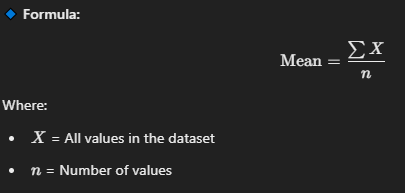

# Linear Regression


#### Linear Regression in Data Science Using Python: A Step-by-Step Tutorial

Linear Regression is a fundamental statistical technique used in data science to model the relationship between a dependent variable and one or more independent variables. In this tutorial, codeswithpankaj will walk you through the steps to perform linear regression using Python. We'll use simple language to make it easy to understand for students.

**Table of Contents**

1. Introduction to Linear Regression
2. Setting Up the Environment
3. Loading the Dataset
4. Exploring the Data
5. Preparing the Data
6. Building the Linear Regression Model
7. Evaluating the Model
8. Making Predictions
9. Conclusion

***

#### 1. Introduction to Linear Regression

Linear regression aims to find the best-fitting straight line through the data points. The line is defined by the equation:


$$
y=mx+c
$$

<figure><figcaption></figcaption></figure>

**History and Applications** Linear regression has a rich history and numerous applications across various fields:

* **History**: The concept dates back to the early 19th century when Francis Galton and Karl Pearson developed the principles.
* **Applications**: It's widely used in economics (predicting consumer spending), biology (estimating growth rates), and engineering (modeling system behavior).

**Types of Linear Regression**

1. **Simple Linear Regression**: Models the relationship between two variables by fitting a linear equation.
2. **Multiple Linear Regression**: Extends simple linear regression by modeling the relationship between multiple independent variables and a dependent variable.

#### 2. Setting Up the Environment

First, we need to install the necessary libraries. We'll use `numpy`, `pandas`, `matplotlib`, and `scikit-learn`.

```python
# Install the libraries (uncomment the lines below if you haven't installed them yet)
# !pip install numpy pandas matplotlib scikit-learn

import numpy as np
import pandas as pd
import matplotlib.pyplot as plt
from sklearn.model_selection import train_test_split
from sklearn.linear_model import LinearRegression
from sklearn.metrics import mean_squared_error, r2_score
```

**Explanation of Libraries**:

* **Numpy**: Used for numerical operations.
* **Pandas**: Used for data manipulation and analysis.
* **Matplotlib**: Used for data visualization.
* **Scikit-learn**: Provides tools for machine learning, including linear regression.

#### 3. Loading the Dataset

We'll use a simple dataset for this tutorial. You can use any dataset, but for simplicity, we'll create a synthetic dataset.

```python
# Create a synthetic dataset
np.random.seed(0)
X = 2 * np.random.rand(100, 1)
y = 4 + 3 * X + np.random.randn(100, 1)

# Convert to pandas DataFrame
data = pd.DataFrame(data=np.hstack((X, y)), columns=['X', 'y'])
```

**Understanding the Data**:

* **X**: Independent variable (feature).
* **y**: Dependent variable (target).
* **Synthetic Dataset**: Created using random numbers to simulate real-world data.

#### 4. Exploring the Data

Let's take a look at the first few rows of the dataset to understand its structure.

```python
# Display the first few rows of the dataset
print(data.head())
```

**Data Exploration Techniques**:

* **Head Method**: Shows the first few rows.
* **Describe Method**: Provides summary statistics.
* **Info Method**: Gives information about data types and non-null values.

#### 5. Preparing the Data

We'll split the data into training and testing sets to evaluate the model's performance.

```python
# Split the data into training and testing sets
X_train, X_test, y_train, y_test = train_test_split(X, y, test_size=0.2, random_state=0)
```

**Importance of Data Splitting**:

* **Training Set**: Used to train the model.
* **Testing Set**: Used to evaluate the model's performance.
* **Test Size**: Proportion of the dataset used for testing (e.g., 20%).

#### 6. Building the Linear Regression Model

Now, let's build the linear regression model using the training data.

```python
# Create the Linear Regression model
model = LinearRegression()

# Train the model
model.fit(X_train, y_train)
```

**Steps in Model Building**:

1. **Model Creation**: Instantiate the linear regression model.
2. **Model Training**: Fit the model to the training data using the `fit` method.

#### 7. Evaluating the Model

We'll evaluate the model by calculating the mean squared error (MSE) and the coefficient of determination (R²).

```python
# Make predictions on the test data
y_pred = model.predict(X_test)

# Calculate the mean squared error
mse = mean_squared_error(y_test, y_pred)

# Calculate the coefficient of determination
r2 = r2_score(y_test, y_pred)

print(f"Mean Squared Error: {mse}")
print(f"R² Score: {r2}")
```

**Evaluation Metrics**:

* **Mean Squared Error (MSE)**: Measures the average squared difference between predicted and actual values.
* **R² Score**: Indicates the proportion of the variance in the dependent variable that is predictable from the independent variable(s).

#### 8. Making Predictions

Finally, let's use the model to make predictions.

```python
# Example: Predicting the value for a new data point
new_data = np.array([[1.5]])
prediction = model.predict(new_data)
print(f"Prediction for X=1.5: {prediction[0][0]}")
```

**Prediction Process**:

* **New Data**: Input data for which we want to make predictions.
* **Model Prediction**: Use the `predict` method to get the predicted value.

***

#### Real-World Applications

**Case Studies**:

1. **House Price Prediction**: Predicting house prices based on various features like size, location, and amenities.
2. **Sales Forecasting**: Predicting future sales based on historical data.
3. **Customer Segmentation**: Identifying customer segments based on purchasing behavior.

**Projects**:

1. **Predicting Housing Prices**:
   * **Dataset**: Kaggle House Prices dataset.
   * **Steps**: Data cleaning, feature engineering, model training, and evaluation.
2. **Sales Prediction for Retail Stores**:
   * **Dataset**: Retail sales data.
   * **Steps**: Data preprocessing, model selection, training, and prediction.

#### Conclusion

Linear Regression is a versatile and essential tool in data science. By understanding its concepts and implementation, you can apply it to various real-world problems. This tutorial has provided a comprehensive guide to linear regression using Python, from basic concepts to advanced topics and applications.

For more tutorials and resources, visit [codeswithpankaj.com](https://codeswithpankaj.com). If you have any questions or need further clarification, feel free to ask!

***
